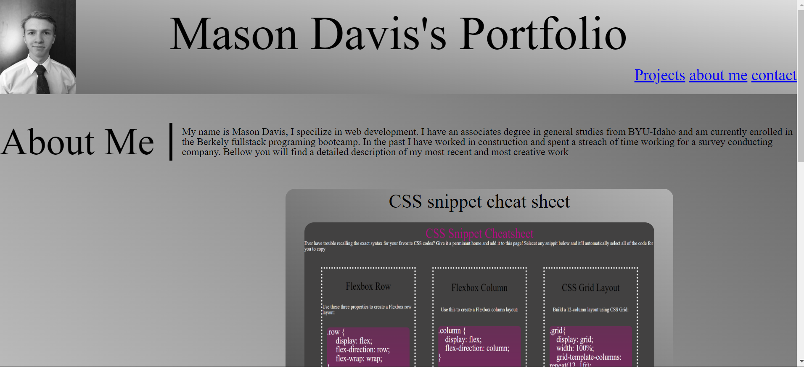

# Mason Davis Portfolio

## Deployed link
* [Mason Davis's Portfolio](https://md7113.github.io/Mason-Davis-Portfolio/)

## site picture



## Technologies Used
- HTML : Used to format the content of the page
- CSS : Used to style the HTML on the web browser
- Git : Used to version control the code during the creation process
- GitHub : hosting the repositroy responsible for the website

## Authors
- Writen and styled By Mason Davis

## summary
This repository contains all the code and images for a website meant to searve as a portfolio of all of the work of Mason Davis. It was written and is maintained by Mason. The portfolio contains links and images to many of Masons projects, these are also available at his GitHub (reference author links)

## Code Snippet
This is a snippet Showing the gradiant formula used across the page. it is a cruical element to the style and desgin of the page

```css
header{
    height: 150px;
    background-image: linear-gradient(to top right, rgba(0, 0, 0, 0.589) 0%, 
    rgba(204, 204, 204, 0.671) 100%);
}
```


## Author links
[LinkedIn](https://www.linkedin.com/in/davis-mason-t/)
[GitHub](https://github.com/Md7113)